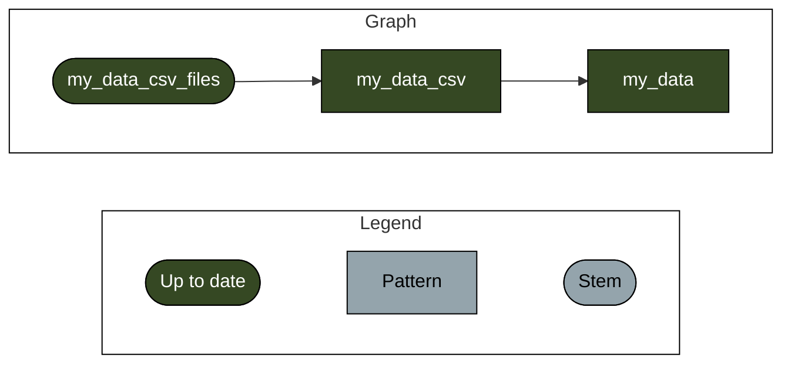

<!-- README.md is generated from README.Rmd. Please edit that file -->

# telemetar

<!-- badges: start -->

[](https://lifecycle.r-lib.org/articles/stages.html#experimental)
[](https://CRAN.R-project.org/package=telemetar)
[](https://mhpob.r-universe.dev/telemetar)
[](https://github.com/mhpob/telemetar/actions/workflows/R-CMD-check.yaml)
<!-- badges: end -->

This package aims to provide
[`targets`](https://docs.ropensci.org/targets/) archetypes for analysis
of fish acoustic telemetry data *a la* the
[`tarchetypes`](https://docs.ropensci.org/tarchetypes/) package. The
eventual hope is to play nicely with the [R
Targetopia](https://wlandau.github.io/targetopia/); if you’d like to
contribute please follow the [Targetopia development
guidelines](https://wlandau.github.io/targetopia/contributing.html).

Like the package, the name is a work in progress: [vote for your
favorite or suggest another name
here](https://github.com/mhpob/telemetar/discussions/2)! Some
candidates:

- `telemetar` (current)
- `sharketypes`
- ~~`egrets`~~ (taken)
- `trackytypes`
- `trackets`

## Installing

If you’d like to give what has been put together a whirl, install the
current version of this package from R-Universe or GitHub. **However,
please know that everything is completely experimental – functions will
be frequently changed, renamed, broken, or not work at all!**

R-universe:

``` r
install.packages(
  "telemetar",
  repos = c(
    "https://mhpob.r-universe.dev",
    "https://cloud.r-project.org"
  )
)
```

GitHub:

``` r
# install.packages("remotes")
remotes::install_github("mhpob/telemetar")
```

## Reading and combining VUE CSVs

`tar_vue_csvs` takes a directory of VUE-exported CSVs, tracks them for
changes, and imports the relevant data. This assumes that your data is
housed within a directory or series of sub-directories. Something like:

    project_detections/
      |-- receiver1_jan.csv
      |-- receiver2_jan.csv
      |-- receiver1_march.csv
      |-- receiver2_march.csv

**OR** something like:

    project_detections/
      |
      |-- January tending/
          |-- receiver1_jan.csv
          |-- receiver2_jan.csv
      |-- March tending/
          |-- receiver1_march.csv
          |-- receiver2_march.csv

``` r
library(targets)
library(telemetar)
```

``` r
targets::tar_script({
  library(telemetar)
  
  tar_vue_csvs(
    my_data,
    'c:/users/darpa2/analysis/chesapeake-backbone/embargo/raw')
}, ask = FALSE)

targets::tar_make()
#> ▶ dispatched target my_data_csv_files
#> ● completed target my_data_csv_files [0 seconds]
#> ▶ dispatched branch my_data_csv_df58d0e9
#> ● completed branch my_data_csv_df58d0e9 [0 seconds]
#> ● completed pattern my_data_csv
#> ▶ dispatched branch my_data_31709a7f
#> ● completed branch my_data_31709a7f [0.422 seconds]
#> ● completed pattern my_data
#> ▶ completed pipeline [1.375 seconds]
```

``` r
targets::tar_objects()
#> [1] "my_data_31709a7f"  "my_data_csv_files"

head(targets::tar_read(my_data))
#>               datetime     receiver    transmitter transmittername
#>                 <POSc>       <char>         <char>          <lgcl>
#> 1: 2022-05-04 16:45:50 VR2AR-546211 A69-1601-60675              NA
#> 2: 2022-05-04 16:55:50 VR2AR-546211 A69-1601-60675              NA
#> 3: 2022-05-04 17:10:08 VR2AR-546211 A69-1601-60675              NA
#> 4: 2022-05-04 17:20:28 VR2AR-546211 A69-1601-60921              NA
#> 5: 2022-05-04 17:20:58 VR2AR-546211 A69-1601-60675              NA
#> 6: 2022-05-04 17:31:36 VR2AR-546211 A69-1601-60675              NA
#>    transmitterserial sensorvalue sensorunit stationname latitude longitude
#>               <lgcl>       <int>     <char>      <char>   <lgcl>    <lgcl>
#> 1:                NA          NA       <NA>         CP3       NA        NA
#> 2:                NA          NA       <NA>         CP3       NA        NA
#> 3:                NA          NA       <NA>         CP3       NA        NA
#> 4:                NA          NA       <NA>         CP3       NA        NA
#> 5:                NA          NA       <NA>         CP3       NA        NA
#> 6:                NA          NA       <NA>         CP3       NA        NA
#>    transmittertype sensorprecision
#>             <lgcl>          <lgcl>
#> 1:              NA              NA
#> 2:              NA              NA
#> 3:              NA              NA
#> 4:              NA              NA
#> 5:              NA              NA
#> 6:              NA              NA
```

Now, the importing step and any further analyses that depend on our
detection data will only be run if a file in that directory (or
sub-directories) is added or removed.

``` r
targets::tar_make()
#> ✔ skipped target my_data_csv_files
#> ✔ skipped branch my_data_csv_df58d0e9
#> ✔ skipped pattern my_data_csv
#> ✔ skipped branch my_data_31709a7f
#> ✔ skipped pattern my_data
#> ✔ skipped pipeline [0.203 seconds]
```

It also creates some useful dependency graphs:


